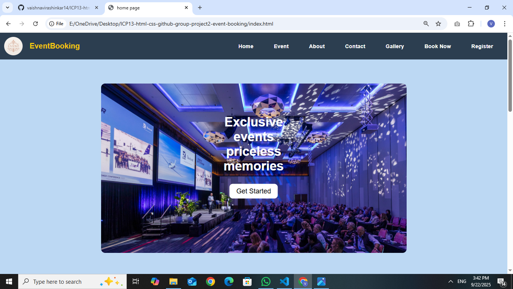

# Event Booking 🏩
A modern and responsive event booking platform where users can book events like wedding,sports and education events.

## Features
- User friendly interface for booking events
- Event categories(Social Event,Education Event,Sports Event)
- Easy navigation with responsive design
- Hosted on netlify

## Home Page

## Technologies Use

- HTML
- CSS

## Contributors

1. **Dipti Bhawar** (index.html)
2. **Vaishnavi Rashinkar** (resistration.html,login.html,event.html)
3. **Monika Bagal** (about.html,contact.html)
4. **Pranali Pekhale** (order.html,payment.html,bill.html)
5. **Kavery Bhosale** (gallary.html) 
6. **Natasha Chainani** (socialevent.html)
7. **Abhi Sanap** (education.html)
8. **Hemang khedikar** (sports.html)

## 📞 Contact 
**Email:** eventbooking321@gmail.com
**Phone:** 7666020037
**Address:** 401, Abhipreet Residency, Pan Card Club Rd, Baner, Pune, Maharashtra 411069
